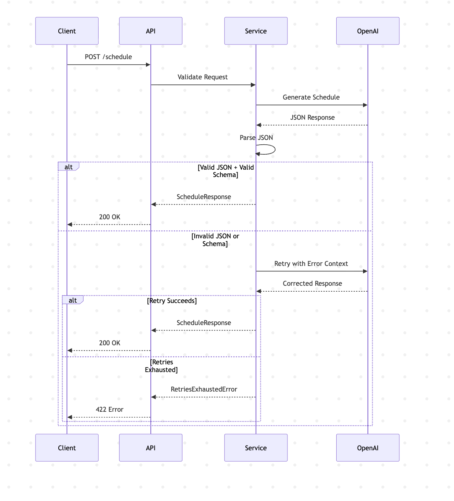
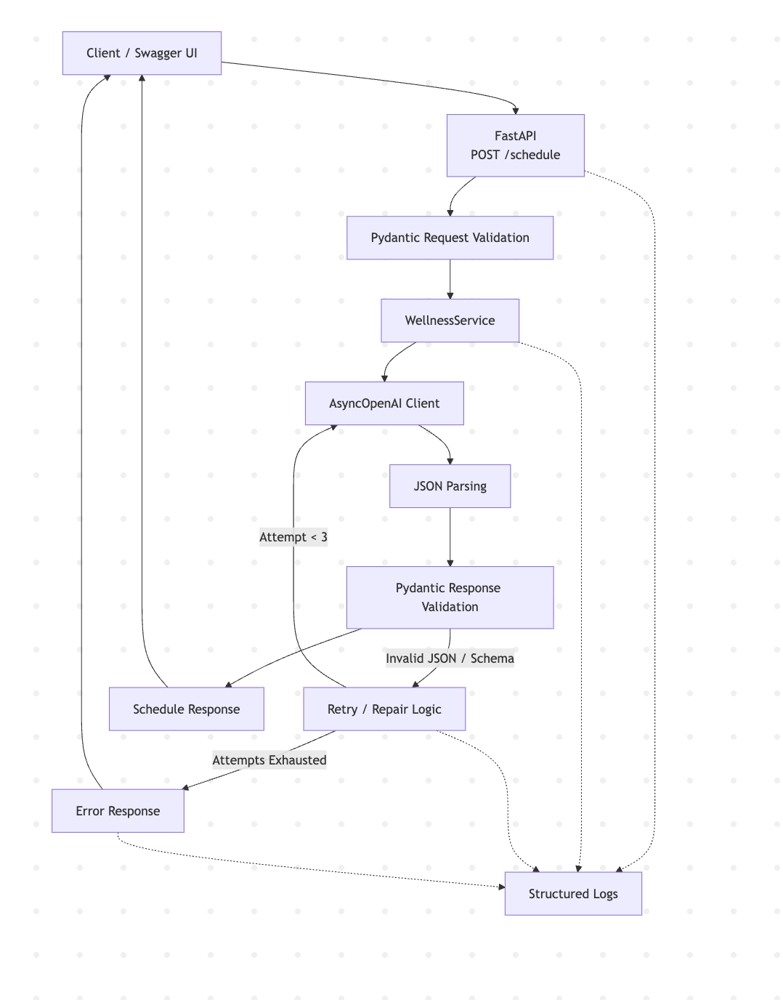
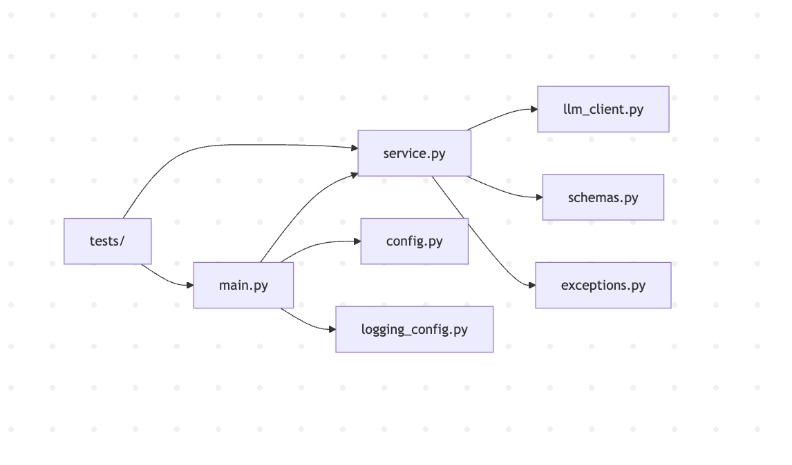
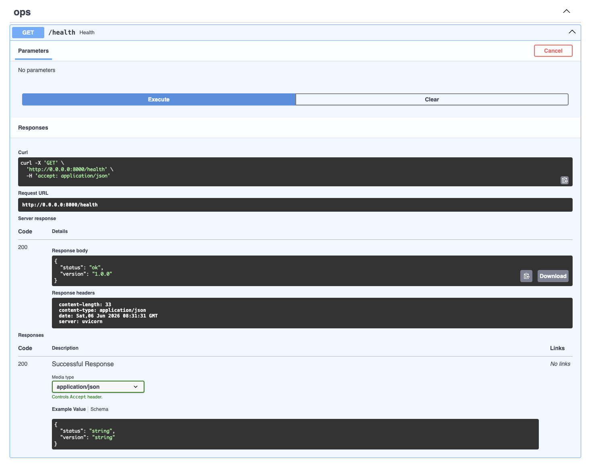
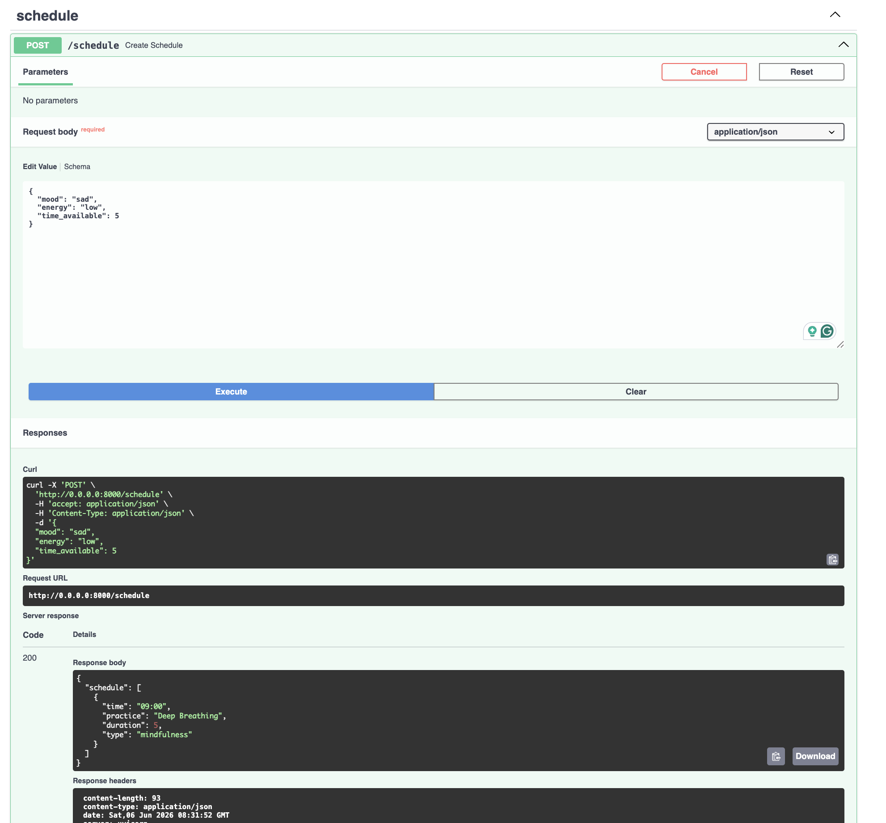
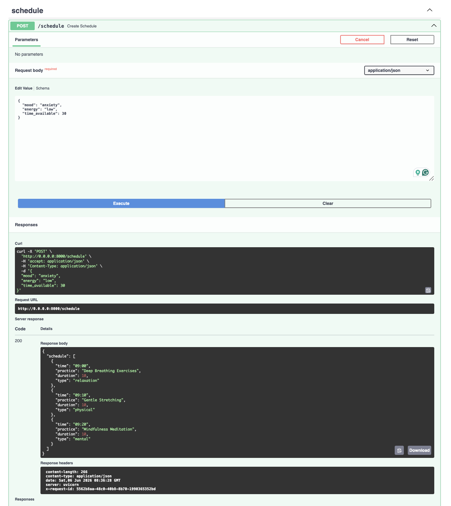

# Wellness Schedule API

A production-grade FastAPI service that generates personalized daily wellness schedules using an LLM. Built around strict schema validation, a retry/repair loop, structured JSON observability, and a clean separation between transport, business logic, and LLM I/O.

---

## Features

- `POST /schedule` — generates a personalized wellness plan from mood, energy, and available time
- `GET /health` — liveness probe for orchestrators and load balancers
- Strict Pydantic v2 validation on both the inbound request and the LLM response
- Retry/repair loop (up to `MAX_RETRIES` attempts) that injects the exact prior validation error into the next prompt
- Timeouts fail fast with a `504` — they are not retried
- Structured JSON logging on every attempt: `request_id`, `attempt`, `latency_ms`, `success`, `error`
- `X-Request-Id` header on every response for distributed tracing
- Mock LLM mode for local development and CI — no API key required
- All configuration driven by environment variables
- Non-root Docker image with a working healthcheck

---

## Architecture

### Architecture Overview



### Request Flow



### Project Structure



---

## API Demonstration

### Health Check Endpoint



### Schedule Generation Examples





---

## Project Structure

```
AI_Shedule/
├── app/
│   ├── main.py            FastAPI app, routes, request_id generation, HTTP error shaping
│   ├── config.py          Pydantic-Settings; all tunables loaded from env / .env
│   ├── schemas.py         Pydantic v2 models for request, response, and error payloads
│   ├── llm_client.py      AsyncOpenAI wrapper; prompt construction; mock mode
│   ├── service.py         Retry/repair loop; JSON parsing; validation; structured logging
│   ├── logging_config.py  JSON log formatter; stdout output
│   └── exceptions.py      Typed exception hierarchy
├── tests/
│   ├── conftest.py        Sets MOCK_LLM=true; no API key required
│   ├── test_api.py        HTTP-layer tests via httpx AsyncClient
│   ├── test_service.py    Retry logic, timeout propagation, prompt repair
│   └── test_validation.py Pydantic model edge cases
├── images/                Architecture diagrams and API screenshots
├── .env.example
├── .dockerignore
├── Dockerfile
├── docker-compose.yml
├── requirements.txt       Production dependencies only
├── requirements-dev.txt   Adds pytest, httpx
└── pytest.ini
```

---

## Environment Variables

Copy `.env.example` to `.env` and fill in the values.

| Variable         | Default       | Description                                       |
|------------------|---------------|---------------------------------------------------|
| `OPENAI_API_KEY` | *(required)*  | OpenAI secret key                                 |
| `OPENAI_MODEL`   | `gpt-4o-mini` | Chat completion model name                        |
| `OPENAI_TIMEOUT` | `30.0`        | Per-request timeout in seconds                    |
| `MAX_RETRIES`    | `3`           | Maximum LLM call attempts per request             |
| `MOCK_LLM`       | `false`       | Return a hardcoded fixture; skip OpenAI entirely  |
| `LOG_LEVEL`      | `INFO`        | Python log level (`DEBUG`, `INFO`, `WARNING`, …)  |

---

## Running Locally

**With a real OpenAI key:**

```bash
cp .env.example .env
# Add your OPENAI_API_KEY to .env

python -m venv .venv && source .venv/bin/activate
pip install -r requirements-dev.txt

uvicorn app.main:app --reload
```

**With mock LLM (no API key needed):**

```bash
MOCK_LLM=true uvicorn app.main:app --reload
```

The API is available at `http://localhost:8000`.
Interactive docs at `http://localhost:8000/docs`.

---

## Running with Docker

```bash
cp .env.example .env
# Add your OPENAI_API_KEY to .env

docker compose up --build
```

The container runs as a non-root user. The healthcheck uses Python's built-in `urllib` so no extra system packages are required.

---

## Testing

```bash
pip install -r requirements-dev.txt
pytest -v
```

Tests never require a real OpenAI key. `tests/conftest.py` sets `MOCK_LLM=true` before any app module is imported.

```
tests/test_api.py        — HTTP layer: status codes, response shapes, headers, error bodies
tests/test_service.py    — Retry loop, timeout propagation, prompt repair, call counts
tests/test_validation.py — Pydantic edge cases: time format, energy enum, duration bounds
```

**Example output:**

```
tests/test_api.py::test_health_returns_ok                              PASSED
tests/test_api.py::test_schedule_returns_200_with_valid_body           PASSED
tests/test_api.py::test_schedule_response_carries_request_id_header    PASSED
tests/test_api.py::test_schedule_validates_unknown_energy_level        PASSED
tests/test_api.py::test_schedule_validates_time_available_below_minimum PASSED
tests/test_api.py::test_schedule_rejects_extra_fields_in_body         PASSED
tests/test_api.py::test_schedule_retries_exhausted_returns_422_...     PASSED
tests/test_api.py::test_schedule_timeout_returns_504_with_error_body   PASSED
tests/test_api.py::test_schedule_practice_items_have_correct_shape     PASSED
tests/test_service.py::test_successful_generation_returns_schedule     PASSED
tests/test_service.py::test_retries_on_invalid_json_and_succeeds       PASSED
tests/test_service.py::test_retries_on_schema_validation_error_...     PASSED
tests/test_service.py::test_raises_retries_exhausted_after_max_...     PASSED
tests/test_service.py::test_first_attempt_has_no_previous_error        PASSED
tests/test_service.py::test_retry_passes_error_message_to_next_prompt  PASSED
tests/test_service.py::test_retries_exhausted_error_contains_...       PASSED
tests/test_service.py::test_succeeds_on_first_attempt_makes_single_call PASSED
tests/test_service.py::test_timeout_propagates_immediately_without_retry PASSED
tests/test_validation.py::...                                          PASSED (×12)
```

---

## API Reference

### `GET /health`

```bash
curl http://localhost:8000/health
```

```json
{"status": "ok", "version": "1.0.0"}
```

---

### `POST /schedule`

**Request body:**

| Field            | Type                          | Constraints          |
|------------------|-------------------------------|----------------------|
| `mood`           | `string`                      | 1–50 characters      |
| `energy`         | `"low"` \| `"medium"` \| `"high"` | required enum    |
| `time_available` | `integer`                     | 5–480 minutes        |

```bash
curl -i -X POST http://localhost:8000/schedule \
  -H "Content-Type: application/json" \
  -d '{"mood": "anxiety", "energy": "low", "time_available": 30}'
```

**200 response:**

```json
{
  "schedule": [
    {"time": "09:00", "practice": "Grounding breathing", "duration": 5,  "type": "meditation"},
    {"time": "09:05", "practice": "Gentle body scan",    "duration": 10, "type": "mindfulness"},
    {"time": "09:15", "practice": "Slow mindful walk",   "duration": 15, "type": "movement"}
  ]
}
```

The `X-Request-Id` header on the response contains a UUID that appears in every related log line.

**Validation error (client-side) — `422`:**

```bash
curl -X POST http://localhost:8000/schedule \
  -H "Content-Type: application/json" \
  -d '{"mood": "calm", "energy": "extreme", "time_available": 30}'
```

```json
{"detail": [{"type": "enum", "loc": ["body", "energy"], "msg": "Input should be 'low', 'medium' or 'high'"}]}
```

---

## Error Handling

All non-200 responses from the service layer use a consistent envelope:

```json
{
  "request_id": "f47ac10b-58cc-4372-a567-0e02b2c3d479",
  "error": "Failed to generate a valid schedule after maximum retries.",
  "code": "RETRIES_EXHAUSTED"
}
```

| HTTP | `code`              | Cause                                                         |
|------|---------------------|---------------------------------------------------------------|
| 422  | `RETRIES_EXHAUSTED` | LLM produced invalid JSON or schema after all retry attempts  |
| 504  | `TIMEOUT`           | OpenAI request exceeded `OPENAI_TIMEOUT`; not retried         |
| 500  | `INTERNAL_ERROR`    | Unexpected server-side failure                                |

Internal stack traces are never exposed to the client.

---

## Logging

Every LLM attempt emits a single structured JSON log line to stdout:

```json
{
  "timestamp": "2026-06-07 10:00:01,123",
  "level": "WARNING",
  "logger": "app.service",
  "message": "llm_attempt_failed",
  "request_id": "f47ac10b-58cc-4372-a567-0e02b2c3d479",
  "attempt": 1,
  "input": {"mood": "anxiety", "energy": "low", "time_available": 30},
  "raw_output": "not json {{",
  "success": false,
  "error": "JSON parse error: Expecting value: line 1 column 1 (char 0)",
  "latency_ms": 312.4
}
```

End-to-end request latency appears in the `request_completed` / `retries_exhausted` / `request_timeout` log line so dashboards can track p95 without joining multiple log events.

The `request_id` is also forwarded to OpenAI as an `X-Request-Id` header, enabling correlation across the service boundary if needed.

---

## Engineering Decisions

### LLM output is treated as untrusted data

The model response is parsed with `json.loads` and then validated with `ScheduleResponse.model_validate`. There is no trust placed in what the LLM returns, it must pass the same schema checks as any external input. All Pydantic models use `extra="forbid"` so any unexpected fields cause an immediate validation failure rather than silently passing through.

### Repair loop over blind retry

On a parse or schema failure, the exact error message `JSONDecodeError` text or Pydantic's `ValidationError` detail is injected verbatim into the next prompt. This gives the model concrete, actionable feedback rather than asking it to guess what went wrong. The repair loop runs up to `MAX_RETRIES` times.

### Timeouts are not retried

A timeout means the upstream service is under load. Retrying immediately would increase that load without any expectation of a different outcome. Timeouts propagate directly to the caller as `504 TIMEOUT`. JSON and schema failures, which the model can fix with feedback, are retried.

### Temperature 0.2 for structured output

The task is deterministic: given a mood, energy level, and duration, produce a valid JSON schedule. Higher temperatures increase token variance and therefore the probability of malformed JSON. `temperature=0.2` keeps outputs stable while allowing enough variation to produce meaningfully different schedules.

### Structured logging with request_id on every line

Each log event carries the `request_id`, `attempt`, `latency_ms`, and `success` flag. This makes it possible to reconstruct the full lifecycle of any request, including all retry attempts, from a log aggregator without joining multiple records by time range or position.

### Mock mode for local development and CI

Setting `MOCK_LLM=true` bypasses OpenAI entirely and returns a hardcoded valid response. All tests use this mode. No mocking framework is needed at the HTTP level and no API key is required in CI pipelines.

### Safe error responses

The public API never exposes internal exception messages, stack traces, or model outputs. All error paths return a structured `ErrorDetail` body with `request_id`, a human-readable `error` string, and a machine-readable `code`. Internal details are logged server-side at the appropriate level.

### Requirements split by environment

`requirements.txt` contains only production dependencies (`fastapi`, `uvicorn`, `openai`, `pydantic`, `pydantic-settings`). Test dependencies (`pytest`, `pytest-asyncio`, `httpx`) are in `requirements-dev.txt`. The Docker image installs only the production requirements, keeping the image surface area minimal.
